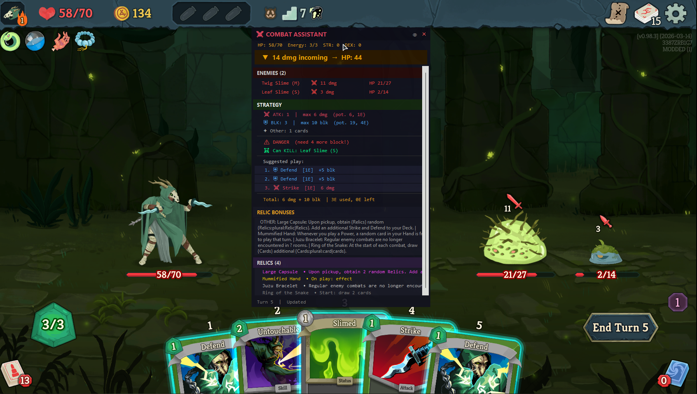

## BoberInSpire – Slay the Spire 2 Combat Assistant



BoberInSpire is a **hybrid C# + Python assistant** for Slay the Spire 2.  
A custom C# mod exports the current combat / merchant state to JSON, and a Python overlay analyzes it and shows real‑time information in a separate, semi‑transparent window.

### Main features

- **Real-time combat state** – mod exports hand, energy, block, and enemy data to JSON.
- **Damage and block summary** – overlay shows net damage and per-enemy incoming damage.
- **Relic summaries** – combat-relevant relic effects shown in a compact list.
- **Semi-transparent overlay** – always-on-top window with ghost (click-through) mode (F9).

---

### Data source & acknowledgments

Card and relic data used by the overlay comes from **[Spire Codex](https://spire-codex.com/)**, the Slay the Spire 2 database and API built from decompiled game data. Many thanks to the Spire Codex project for making this data available.

- **Website:** [https://spire-codex.com/](https://spire-codex.com/)
- **Repository:** [https://github.com/ptrlrd/spire-codex](https://github.com/ptrlrd/spire-codex)

## Requirements

- **Slay the Spire 2** (Steam, default path used in the mod):
  - `C:\Program Files (x86)\Steam\steamapps\common\Slay the Spire 2`
- **.NET 9 SDK** (for building the C# mod).
- **Godot 4.x Mono** (only needed for the automatic `.pck` build step; if you don’t have it, you can still copy the built DLL manually).
- **Python 3.11** (recommended; the repo uses `py -3.11` in commands).
- **Pip packages**: `watchdog`, `keyboard` (see `requirements.txt`).

The mod loader (GUMM) must already be installed in your STS2 directory, and **modding must be enabled**.

---

## Building and running the installer

To produce a single installer that deploys both the overlay and the mod:

1. **Build the distribution** (from the project root, with STS2 closed):

   ```bat
   .\build.bat
   ```
   (In PowerShell you must use `.\build.bat`; in cmd you can use `build.bat`.)

   This builds the C# mod in Release, exports the `.pck` (if Godot is on `PATH` or set via `GODOT_EXE`), and fills `dist\BoberInSpire\` with the overlay app, data, and mod files.

2. **Compile the installer** (requires [Inno Setup](https://jrsoftware.org/isinfo.php)):

   - **Option A – Add Inno Setup to PATH (once):**  
     Windows → Settings → System → About → Advanced system settings → Environment Variables. Under *User* or *System* variables, edit **Path**, add:  
     `C:\Program Files (x86)\Inno Setup 6`  
     Confirm, then open a **new** terminal. You can then run:
     ```bat
     iscc installer.iss
     ```
   - **Option B – Run without PATH** (from the project root, in PowerShell):
     ```powershell
     & "C:\Program Files (x86)\Inno Setup 6\ISCC.exe" installer.iss
     ```

   The installer is created as **`dist\BoberInSpire_Setup_1.0.0.exe`**.

3. **Run the installer** – choose install path, optional desktop shortcut, and optionally “Copy mod to Slay the Spire 2” (you will be asked for the game path). After install, run **BoberInSpire Overlay** from the Start Menu (or desktop). Python 3.11 must be installed and on `PATH` for the overlay to run.

---

## 1. Building and installing the C# mod (manual)

### 1.1. (Optional) Configure custom game path

If your STS2 is installed in the default location, you can skip this.  
Otherwise, create `STS2Mods/sts2_example_mod/local.props` with:

```xml
<Project>
  <PropertyGroup>
    <STS2GamePath>C:\Path\To\Your\Slay the Spire 2</STS2GamePath>
    <GodotExePath>C:\Path\To\Godot_mono.exe</GodotExePath> <!-- optional -->
  </PropertyGroup>
</Project>
```

### 1.2. Build the mod

From the project root (`BoberInSpire`), **with the game closed**:

```bash
dotnet build STS2Mods\sts2_example_mod\ExampleMod.csproj -c Debug
```

On success:

- `BoberInSpire.dll` is built to  
  `STS2Mods\sts2_example_mod\bin\Debug\net9.0\BoberInSpire.dll`
- The build script copies it (and the `.pck`) to:
  - `C:\Program Files (x86)\Steam\steamapps\common\Slay the Spire 2\mods\BoberInSpire\`

> If you see an error like “file is being used by another process”, it means **STS2 is still running** – close the game and build again.

### 1.3. Enable the mod in the game

1. Start STS2 via GUMM (modded launch).
2. In the mod list, ensure **BoberInSpire** is enabled.
3. Start a run; at the beginning of combat, the mod will start writing `bober_combat_state.json` to your STS2 user directory.

On Windows, this file resolves to:

```text
%APPDATA%\SlayTheSpire2\bober_combat_state.json
```

---

## 2. Python overlay – setup and usage

### 2.1. Install Python dependencies

From the project root:

```bash
py -3.11 -m pip install -r requirements.txt
```

If you want a virtualenv:

```bash
py -3.11 -m venv .venv
.venv\Scripts\activate
py -3.11 -m pip install -r requirements.txt
```

### 2.2. Run the overlay

The default `main.py` already knows the expected location of the combat state file, so the **simplest way** is:

```bash
py -3.11 -m python_app.main
```
(Run from the project root.)

This will:

- Start the Tkinter overlay window.
- Begin watching `%APPDATA%\SlayTheSpire2\bober_combat_state.json` for changes.

You can also pass the path explicitly:

```bash
py -3.11 -m python_app.main -f "%APPDATA%\SlayTheSpire2\bober_combat_state.json"
```

Once running:

- Launch STS2 (modded) and enter combat.
- The overlay should begin updating in real time.

### 2.3. Overlay controls

- **Drag window** – click and drag the custom title bar.
- **Close** – click the `X` in the title bar.
- **Ghost mode (click‑through)**:
  - Click the **eye icon** in the title bar, or press **F9**.
  - In ghost mode:
    - The overlay becomes more transparent.
    - Mouse clicks go “through” the window to the game.
  - Press F9 again to return to interactive mode.
