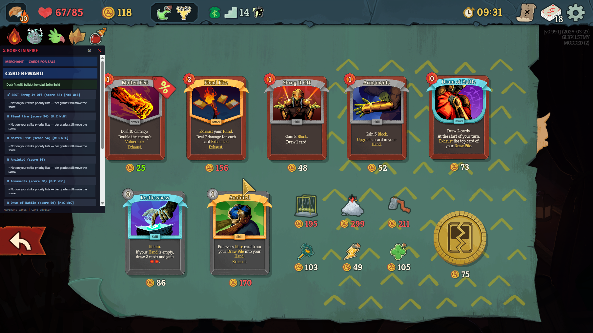

## BoberInSpire – Slay the Spire 2 Combat Assistant


BoberInSpire is a **hybrid C# + Python assistant** for Slay the Spire 2.  
A custom C# mod exports the current combat / merchant state to JSON, and a Python overlay analyzes it and shows real‑time information in a separate, semi‑transparent window.

### Main features

- **Real-time combat state** – mod exports hand, energy, block, and enemy data to JSON.
- **Damage and block summary** – overlay shows net damage and per-enemy incoming damage.
- **Relic summaries** – combat-relevant relic effects shown in a compact list.
- **Semi-transparent overlay** – always-on-top window with ghost (click-through) mode (F9).
- **Card reward advisor** – on the post-combat **Choose a Card** screen, ranks the three offered cards using **[Mobalytics](https://mobalytics.gg/slay-the-spire-2/tier-lists/cards) S/A/B/C/D tier lists** (per character) **combined** with deck/archetype heuristics from local build guides. The overlay shows **BEST**, tier letter, blended score, and a short reason (e.g. `Mobalytics B-tier; …`).

#### Card pick advisor (screenshot)



The mod writes reward options to `%APPDATA%\SlayTheSpire2\bober_reward_state.json`; the overlay reads them and updates the **CHOOSE A CARD / CARD REWARD** section. Tier data lives in `data/tier_lists/mobalytics_cards.json` (see `data/tier_lists/README.md` to refresh from Mobalytics).

### Installing using installer

If you only want to **play** with the mod and overlay, you do **not** need to clone the repo or run `dotnet`. The easiest path is the **Windows installer** (`BoberInSpire_Setup_<version>.exe`), built from this project with `build.bat` + Inno Setup (see [Release package (installer)](#release-package-installer) for maintainers).

#### One-time prerequisites

1. **Slay the Spire 2** installed (e.g. Steam).
2. **Mods folder** — the game reads mods from **`<Slay the Spire 2>\mods\`** (same folder as the game executable). You **do not** need **GUMM** or any extra launcher: the installer can copy the mod files there for you, or you copy them manually (see below). After a game update, if `mods` is missing, create it yourself.
3. **Python 3.11** — install from [python.org](https://www.python.org/downloads/) (Windows installer). During setup, enable **“Add python.exe to PATH”** so the `py` launcher can find Python. The overlay launcher runs `py -3.11`; if `py -3.11 --version` works in Command Prompt, you are set.

> **Optional:** Some players use **GUMM** (Godot Universal Mod Manager) to manage many mods. It is **not** required for BoberInSpire — Steam (or the game exe) is enough once the files sit in `mods\`.

#### Run the installer

1. Download **`BoberInSpire_Setup_<version>.exe`** from the project **Releases** page (when published), or use a build shared by someone else.
2. **Close Slay the Spire 2** before installing or updating mod files.
3. Run the setup wizard and choose an install folder (the wizard suggests a default location).
4. On the **tasks** screen:
   - Optionally enable **Create a desktop shortcut**.
   - **Recommended:** enable **Copy mod to Slay the Spire 2**, then on the next page select your game folder (typical Steam path: `C:\Program Files (x86)\Steam\steamapps\common\Slay the Spire 2`).
5. Finish the installation.

#### Turn the mod on in-game (once)

1. Start **Slay the Spire 2** the normal way (e.g. **Steam**).
2. Open **Settings** and find the **Modding** / **Mods** section (exact labels can change slightly with patches).
3. Make sure modding is allowed and **BoberInSpire** is **enabled**. If you do not see it, confirm the three files are in `mods\` and restart the game.

#### Start the overlay

- Launch **BoberInSpire Overlay** from the Start Menu (or the desktop shortcut). The first run may take a short while: the launcher runs `pip install` for `watchdog` and `keyboard` (**internet required once**).
- Leave the overlay running while you play. Start the game from **Steam** (or your usual shortcut); the mod loads automatically from `mods\` when enabled in settings.

#### If you did not use “copy mod”

Manually copy from the install directory’s **`Mod`** folder into **`<Slay the Spire 2>\mods\`** (flat layout next to other mods):

- `BoberInSpire.dll`
- `BoberInSpire.pck`
- `BoberInSpire.json`

#### Quick troubleshooting

| Issue | Try this |
|--------|-----------|
| Overlay does not start | Open Command Prompt and run `py -3.11 --version`. Install Python 3.11 with PATH enabled, then run the shortcut again. |
| Errors about `pip` / packages | Ensure you are online; from the install folder, run: `py -3.11 -m pip install -r requirements.txt` |
| Mod missing in game | Put the three files in `...\Slay the Spire 2\mods\` (flat, not a subfolder). In **Settings → Modding**, enable BoberInSpire and restart the game. |

---

### Data source & acknowledgments

Card and relic data used by the overlay comes from **[Spire Codex](https://spire-codex.com/)**, the Slay the Spire 2 database and API built from decompiled game data. Many thanks to the Spire Codex project for making this data available.

- **Website:** [https://spire-codex.com/](https://spire-codex.com/)
- **Repository:** [https://github.com/ptrlrd/spire-codex](https://github.com/ptrlrd/spire-codex)

**Card reward tiers** are based on Mobalytics’ [Slay the Spire 2 card tier list](https://mobalytics.gg/slay-the-spire-2/tier-lists/cards) (Early Access / preliminary list — update the JSON when their rankings change).

## Run locally (development)

1. **Build the mod** (with STS2 **closed**):

   ```bat
   dotnet build STS2Mods\sts2_example_mod\ExampleMod.csproj -c Debug
   ```

   This builds **BoberInSpire.dll**, **BoberInSpire.pck**, and **BoberInSpire.json** into your STS2 **`mods\`** folder (flat layout next to other mods — not a subfolder). The project file is still `ExampleMod.csproj`; the mod name and output DLL are **BoberInSpire**.

2. **Install Python deps** (once):

   ```bat
   py -3.11 -m pip install -r requirements.txt
   ```

3. **Run the overlay**:

   ```bat
   py -3.11 -m python_app.main
   ```

4. Start STS2 (e.g. from **Steam**). In **Settings → Modding**, enable **BoberInSpire** if it is not on by default, then enter combat. The overlay watches `%APPDATA%\SlayTheSpire2\bober_combat_state.json` (combat) and **`bober_reward_state.json`** (card rewards) and updates in real time.

> If the mod build fails with "file is being used by another process", **close STS2** and run the build again.

---

## Optional: custom game path

If STS2 is not in the default location, create **`STS2Mods\sts2_example_mod\local.props`**:

```xml
<Project>
  <PropertyGroup>
    <STS2GamePath>C:\Path\To\Your\Slay the Spire 2</STS2GamePath>
    <GodotExePath>C:\Path\To\Godot_mono.exe</GodotExePath>
  </PropertyGroup>
</Project>
```

---

## Overlay controls

- **Drag window** – click and drag the custom title bar.
- **Resize** – drag the small grip in the bottom-right corner.
- **Close** – click the **X** in the title bar.
- **Ghost mode (click-through)** – click the **eye** icon or press **F9**; clicks pass through to the game. Press F9 again to return to interactive mode.
